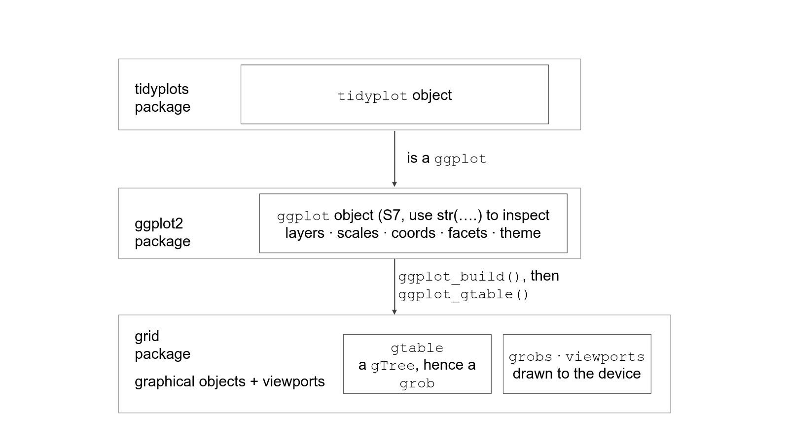

```{r}
#| label: title-panel
#| include: false
library(ggplot2)
library(tidyplots)
library(patchwork)
library(dplyr)
library(tidyr)
library(purrr)

set.seed(42)

cell_types <- c("T cell", "B cell", "Monocyte")
conditions <- c("Control", "Stimulated")
genes      <- c("CD3D", "MS4A1", "LYZ", "IL2")

mean_expr <- function(gene, cell_type, condition) {
  base <- dplyr::case_when(
    gene == "CD3D"  & cell_type == "T cell"   ~ 3.0,
    gene == "MS4A1" & cell_type == "B cell"   ~ 3.2,
    gene == "LYZ"   & cell_type == "Monocyte" ~ 3.5,
    gene == "IL2"   & cell_type == "T cell"   ~ 1.0,
    TRUE ~ 0.3
  )
  bump <- ifelse(gene == "IL2" & cell_type == "T cell" &
                   condition == "Stimulated", 1.6, 0)
  base + bump
}

n_cells <- 40
sc <- tidyr::expand_grid(
  cell_type = cell_types,
  condition = conditions,
  gene      = genes,
  cell      = seq_len(n_cells)
) |>
  dplyr::mutate(
    mu         = purrr::pmap_dbl(list(gene, cell_type, condition), mean_expr),
    expression = pmax(0, rnorm(dplyr::n(), mean = mu, sd = 0.8))
  )

# Violin: marker-gene expression across cell types
markers <- sc |> dplyr::filter(gene %in% c("CD3D", "MS4A1", "LYZ"))
title_violin <- markers |>
  tidyplot(x = cell_type, y = expression, color = cell_type,
           width = NA, height = NA) |>
  add_violin() |>
  add_boxplot(width = 0.15) |>
  remove_legend()

# Heatmap: mean expression per gene x cell_type
heat <- sc |>
  dplyr::group_by(gene, cell_type) |>
  dplyr::summarise(mean_expr = mean(expression), .groups = "drop")
title_heat <- heat |>
  tidyplot(x = cell_type, y = gene, color = mean_expr,
           width = NA, height = NA) |>
  add_heatmap() |>
  remove_legend()

# Dot plot: size = % expressing, color = per-gene z-scored mean
dot <- sc |>
  dplyr::group_by(gene, cell_type) |>
  dplyr::summarise(
    pct_expr = mean(expression > 0) * 100,
    avg_expr = mean(expression),
    .groups  = "drop"
  ) |>
  dplyr::group_by(gene) |>
  dplyr::mutate(avg_scaled = as.numeric(scale(avg_expr))) |>
  dplyr::ungroup()
title_dot <- dot |>
  tidyplot(x = cell_type, y = gene, color = avg_scaled,
           width = NA, height = NA) |>
  add(ggplot2::geom_point(ggplot2::aes(size = pct_expr))) |>
  add(ggplot2::scale_size_area(max_size = 7, name = "% expr")) |>
  remove_legend()

title_panel <- title_violin + title_dot + title_heat +
  patchwork::plot_layout(ncol = 3)

ggplot2::ggsave("title_panel.png", title_panel,
                width = 8, height = 3.2, dpi = 150, bg = "white")
```

## About these examples

Most of these examples are from 
the draft chapters *First steps* and *Arranging plots* in the e-book
Wickham, Navarro, and Pedersen,
*ggplot2: Elegant Graphics for Data Analysis* (3rd ed.), 
(<https://ggplot2-book.org/getting-started.html>, 
<https://ggplot2-book.org/arranging-plots.html>), downloaded June 25, 2026.

We also re-use examples from Selva Prabhakaran's
[Complete ggplot2 Tutorial, Part 1](https://r-statistics.co/Complete-Ggplot2-Tutorial-Part1-With-R-Code.html).

For each example we keep the original **ggplot2** code and plot on one slide, then
the **tidyplots** equivalent on the next.

## Main differences between ggplot2 and tidyplots

- **ggplot2** maps columns to aesthetics inside `aes()`, then stacks `geom_*()`
  and `scale_*()` layers with `+`.
- **tidyplots** pipes the data frame in, then chains `add_*()`, `adjust_*()`,
  and `remove_*()` verbs with the native pipe `|>`.

## Two recurring frictions

1. **No transformed expressions in mappings.** ggplot2 takes
   `aes(y = unemploy / pop)` or `colour = factor(cyl)`. tidyplots' `tidyplot()`
   wants bare column names, so we precompute with `mutate()` first.
2. **No native verb for a few geoms** (frequency polygons, paths). For those
   we use the escape hatch `add(ggplot2::...)`, which drops a raw ggplot2 layer
   into a tidyplot.

## Setup

```{r}
#| label: setup
library(ggplot2)        # the book's package
library(tidyplots)      # the package we translate each step into
library(dplyr)          # for the mutate()/filter() precompute steps
library(mgcv)           # for the GAM smoother example
data("mpg", package = "ggplot2")          # 234 car models
data("economics", package = "ggplot2")    # US economic time series
```

## The `mpg` data

`mpg` (miles per gallon)
is a `tibble` with one row per car model: engine displacement (`displ`), highway mileage (`hwy`),
city mileage (`cty`), drivetrain (`drv`), and `class`.

```{r}
#| label: mpg-head
mpg
```

# 1. Key components: a basic scatterplot

## Basic scatterplot --- ggplot2
::: {style="font-size: 0.7em;"} 
Every plot needs data (in this case the `mpg` `tibble`), an "`aes()`" (short for aesthetic mapping, which
says which columns of `mpg` will be represented on the $x$ axis [column `displ` in the example below]
and which one the $y$ axis [`hwy` -- the highway miles per gallon],
and at least one "`geom()`" [short for geometric object]).
:::

```{r}
#| label: scatter-gg
ggplot(mpg, aes(x = displ, y = hwy)) +   # data + x/y mapping
  geom_point()                           # draw points
```

## Basic scatterplot --- tidyplots
::: {style="font-size: 0.7em;"} 
The mapping goes inside `tidyplot()`; points are `add_data_points()`.
`|>` "redirects" `mpg` as the the first argument to `tidyplot`.
The remaining arguments tell `tidyplot` what column to use for the
$x$ axis and what column to use for the $y$ axis.
:::
```{r}
#| label: scatter-tp
mpg |>
  tidyplot(x = displ, y = hwy, width = NA, height = NA) |>
  add_data_points()
```

# 2. Colour, size, shape

## Mapping colour --- ggplot2

`aes(colour = class)` puts the variable in the mapping.

```{r}
#| label: aes-gg
ggplot(mpg, aes(displ, hwy, colour = class)) +
  geom_point()
```

## Mapping colour --- tidyplots

`color = class` goes inside `tidyplot()`.

```{r}
#| label: aes-tp
mpg |>
  tidyplot(x = displ, y = hwy, color = class, width = NA, height = NA) |>
  add_data_points()
```

## Fixed colour --- ggplot2

A constant colour is *not* an aesthetic, it goes *outside* `aes()`.

```{r}
#| label: fixed-gg
ggplot(mpg, aes(displ, hwy)) +
  geom_point(colour = "blue")   # fixed colour, no legend
```

## Fixed colour --- tidyplots

A plain argument to the geom verb, no legend.

```{r}
#| label: fixed-tp
mpg |>
  tidyplot(x = displ, y = hwy, width = NA, height = NA) |>
  add_data_points(color = "blue")
```

## Color by category + global fit --- ggplot2

Points coloured by `state`, single global linear fit.

```{r}
#| label: bycat-gg
gg <- ggplot(midwest <- ggplot2::midwest, aes(x = area, y = poptotal)) +
  geom_point(aes(col = state), size = 3) +
  geom_smooth(method = "lm", col = "firebrick", size = 2) +
  coord_cartesian(xlim = c(0, 0.1), ylim = c(0, 1000000)) +
  labs(title = "Area Vs Population", y = "Population", x = "Area")
gg
```

## Color by category + global fit --- tidyplots (code)

`color = state` in `tidyplot()` is inherited by **every** later layer, so a naive
`add_curve_fit()` would fit one line per state. We drop the grouping just for
the fit, via the escape hatch.

```{r}
#| label: bycat-tp-code
#| output: false
tp <- midwest |>
  tidyplot(x = area, y = poptotal, color = state, width = NA, height = NA) |>
  add_data_points(size = 3) |>
  add(ggplot2::geom_smooth(ggplot2::aes(color = NULL, group = 1),
                           method = "lm", color = "firebrick", linewidth = 1)) |>
  add(ggplot2::coord_cartesian(xlim = c(0, 0.1), ylim = c(0, 1000000))) |>
  adjust_title("Area Vs Population") |>
  adjust_x_axis_title("Area") |>
  adjust_y_axis_title("Population")
```

## Color by category + global fit --- tidyplots (plot)

```{r}
#| label: bycat-tp-plot
#| echo: false
tp
```

## Grouping by color: a real grammar difference

- In **ggplot2**, a `geom_smooth()` with a fixed `col = "firebrick"` outside
  `aes()` carries **no grouping**, so it fits one global line even when points
  are coloured by `state`.
- In **tidyplots**, the `color = state` set in `tidyplot()` is **global**, every
  statistical layer (`add_curve_fit()`, `add_mean_bar()`, ...) inherits it and
  groups by `state` by default.
- To get a single fit, cancel the inherited grouping with
  `ggplot2::aes(color = NULL, group = 1)` via the escape hatch.
- If you actually want one fit per state, just write `add_curve_fit(method = "lm")`
  with no overrides. The ggplot2 equivalent moves `color = state` into the
  shared `aes()` so `geom_smooth()` inherits it.

# 3. Faceting

## Faceting --- ggplot2

`facet_wrap(~ class)` makes one panel per `class`, with shared scales.

```{r}
#| label: facet-gg
#| fig-width: 7
#| fig-height: 5
ggplot(mpg, aes(displ, hwy)) +
  geom_point() +
  facet_wrap(~ class)
```

## Faceting --- tidyplots

`split_plot()` free-scales each panel; the escape hatch `facet_wrap()` keeps
ggplot2's shared scales.

```{r}
#| label: facet-tp
#| fig-width: 7
#| fig-height: 5
mpg |>
  tidyplot(x = displ, y = hwy, width = NA, height = NA) |>
  add_data_points() |>
  add(ggplot2::facet_wrap(~ class))
```

# 4. Plot geoms

## Smoother --- ggplot2

```{r}
#| label: smooth-gg
ggplot(mpg, aes(displ, hwy)) +
  geom_point() +
  geom_smooth()           # loess by default, with a ribbon
```

## Smoother --- tidyplots

```{r}
#| label: smooth-tp
mpg |>
  tidyplot(x = displ, y = hwy, width = NA, height = NA) |>
  add_data_points() |>
  add_curve_fit()         # loess by default, with a ribbon
```

## Wigglier loess (`span`) --- ggplot2

```{r}
#| label: span-gg
ggplot(mpg, aes(displ, hwy)) +
  geom_point() +
  geom_smooth(span = 0.2)
```

## Wigglier loess (`span`) --- tidyplots

```{r}
#| label: span-tp
mpg |>
  tidyplot(x = displ, y = hwy, width = NA, height = NA) |>
  add_data_points() |>
  add_curve_fit(span = 0.2)
```

## GAM smoother --- ggplot2

```{r}
#| label: gam-gg
ggplot(mpg, aes(displ, hwy)) +
  geom_point() +
  geom_smooth(method = "gam", formula = y ~ s(x))
```

## GAM smoother --- tidyplots

```{r}
#| label: gam-tp
mpg |>
  tidyplot(x = displ, y = hwy, width = NA, height = NA) |>
  add_data_points() |>
  add_curve_fit(method = "gam", formula = y ~ s(x))
```

## Linear fit --- ggplot2

```{r}
#| label: lm-gg
ggplot(mpg, aes(displ, hwy)) +
  geom_point() +
  geom_smooth(method = "lm")
```

## Linear fit --- tidyplots

```{r}
#| label: lm-tp
mpg |>
  tidyplot(x = displ, y = hwy, width = NA, height = NA) |>
  add_data_points() |>
  add_curve_fit(method = "lm")
```

## Overplotting at discrete x --- ggplot2

```{r}
#| label: overplot-gg
ggplot(mpg, aes(drv, hwy)) +
  geom_point()
```

## Overplotting at discrete x --- tidyplots

```{r}
#| label: overplot-tp
mpg |>
  tidyplot(x = drv, y = hwy, width = NA, height = NA) |>
  add_data_points()
```

## Jitter --- ggplot2

```{r}
#| label: jitter-gg
ggplot(mpg, aes(drv, hwy)) + geom_jitter()
```

## Jitter --- tidyplots

```{r}
#| label: jitter-tp
mpg |>
  tidyplot(x = drv, y = hwy, width = NA, height = NA) |>
  add_data_points_jitter(jitter_width = 0.8)
```

## Boxplot --- ggplot2

```{r}
#| label: box-gg
ggplot(mpg, aes(drv, hwy)) + geom_boxplot()
```

## Boxplot --- tidyplots

```{r}
#| label: box-tp
mpg |>
  tidyplot(x = drv, y = hwy, width = NA, height = NA) |>
  add_boxplot()
```

## Violin --- ggplot2

```{r}
#| label: violin-gg
ggplot(mpg, aes(drv, hwy)) + geom_violin()
```

## Violin --- tidyplots

```{r}
#| label: violin-tp
mpg |>
  tidyplot(x = drv, y = hwy, width = NA, height = NA) |>
  add_violin()
```

## Histogram --- ggplot2

```{r}
#| label: hist-gg
ggplot(mpg, aes(hwy)) + geom_histogram()
```

## Histogram --- tidyplots

```{r}
#| label: hist-tp
mpg |>
  tidyplot(x = hwy, width = NA, height = NA) |>
  add_histogram()
```

## Frequency polygon --- ggplot2

```{r}
#| label: freqpoly-gg
ggplot(mpg, aes(hwy)) + geom_freqpoly(binwidth = 2.5)
```

## Frequency polygon --- tidyplots

No native verb, use the escape hatch.

```{r}
#| label: freqpoly-tp
mpg |>
  tidyplot(x = hwy, width = NA, height = NA) |>
  add(ggplot2::geom_freqpoly(binwidth = 2.5))
```

## Freqpoly by group --- ggplot2

```{r}
#| label: freqpoly-grp-gg
ggplot(mpg, aes(displ, colour = drv)) +
  geom_freqpoly(binwidth = 0.5)
```

## Freqpoly by group --- tidyplots

```{r}
#| label: freqpoly-grp-tp
mpg |>
  tidyplot(x = displ, color = drv, width = NA, height = NA) |>
  add(ggplot2::geom_freqpoly(binwidth = 0.5))
```

## Histogram faceted by group --- ggplot2

```{r}
#| label: hist-facet-gg
#| fig-height: 5
ggplot(mpg, aes(displ, fill = drv)) +
  geom_histogram(binwidth = 0.5) +
  facet_wrap(~ drv, ncol = 1)
```

## Histogram faceted by group --- tidyplots

```{r}
#| label: hist-facet-tp
#| fig-height: 5
mpg |>
  tidyplot(x = displ, color = drv, width = NA, height = NA) |>
  add_histogram(binwidth = 0.5) |>
  add(ggplot2::facet_wrap(~ drv, ncol = 1))
```

## Bar chart (counts) --- ggplot2

```{r}
#| label: bar-gg
ggplot(mpg, aes(manufacturer)) + geom_bar()
```

## Bar chart (counts) --- tidyplots

```{r}
#| label: bar-tp
mpg |>
  tidyplot(x = manufacturer, width = NA, height = NA) |>
  add_count_bar()
```

## Bar chart (identity) --- ggplot2

```{r}
#| label: bar-id-gg
drugs <- data.frame(drug = c("a", "b", "c"), effect = c(4.2, 9.7, 6.1))
ggplot(drugs, aes(drug, effect)) + geom_bar(stat = "identity")
```

## Bar chart (identity) --- tidyplots

```{r}
#| label: bar-id-tp
drugs <- data.frame(drug = c("a", "b", "c"), effect = c(4.2, 9.7, 6.1))
drugs |>
  tidyplot(x = drug, y = effect, width = NA, height = NA) |>
  add_sum_bar()
```

## Line plot --- ggplot2

ggplot2 computes the y ratio inside `aes()`.

```{r}
#| label: line-gg
ggplot(economics, aes(date, unemploy / pop)) +
  geom_line()
```

## Line plot --- tidyplots

tidyplots needs a real column, so we `mutate()` it first.

```{r}
#| label: line-tp
economics |>
  mutate(unemploy_rate = unemploy / pop) |>
  tidyplot(x = date, y = unemploy_rate, width = NA, height = NA) |>
  add_line()
```

## Path coloured by year --- ggplot2

```{r}
#| label: path-gg
year <- function(x) as.POSIXlt(x)$year + 1900
ggplot(economics, aes(unemploy / pop, uempmed)) +
  geom_path(colour = "grey50") +
  geom_point(aes(colour = year(date)))
```

## Path coloured by year --- tidyplots

Both transformed columns precomputed; the path goes in via the escape hatch.

```{r}
#| label: path-tp
economics |>
  mutate(unemploy_rate = unemploy / pop,
         year = as.POSIXlt(date)$year + 1900) |>
  tidyplot(x = unemploy_rate, y = uempmed, color = year,
           width = NA, height = NA) |>
  add(ggplot2::geom_path(ggplot2::aes(color = NULL), colour = "grey50")) |>
  add_data_points()
```

# 5. Modifying the axes

## Axis titles --- ggplot2

```{r}
#| label: xlab-gg
ggplot(mpg, aes(cty, hwy)) +
  geom_point(alpha = 1 / 3) +
  xlab("city driving (mpg)") +
  ylab("highway driving (mpg)")
```

## Axis titles --- tidyplots

```{r}
#| label: xlab-tp
mpg |>
  tidyplot(x = cty, y = hwy, width = NA, height = NA) |>
  add_data_points(alpha = 1 / 3) |>
  adjust_x_axis_title("city driving (mpg)") |>
  adjust_y_axis_title("highway driving (mpg)")
```

## Removing titles --- ggplot2

```{r}
#| label: nolab-gg
ggplot(mpg, aes(cty, hwy)) +
  geom_point(alpha = 1 / 3) +
  xlab(NULL) + ylab(NULL)
```

## Removing titles --- tidyplots

```{r}
#| label: nolab-tp
mpg |>
  tidyplot(x = cty, y = hwy, width = NA, height = NA) |>
  add_data_points(alpha = 1 / 3) |>
  remove_x_axis_title() |>
  remove_y_axis_title()
```

## Axis limits --- ggplot2

```{r}
#| label: lim-gg
ggplot(mpg, aes(drv, hwy)) +
  geom_jitter(width = 0.25) +
  xlim("f", "r") +
  ylim(20, 30)
```

## Axis limits --- tidyplots

No category-picking limit, so we filter the data instead.

```{r}
#| label: lim-tp
mpg |>
  dplyr::filter(drv %in% c("f", "r")) |>
  tidyplot(x = drv, y = hwy, width = NA, height = NA) |>
  add_data_points_jitter() |>
  adjust_y_axis(limits = c(20, 30))
```

# 6. Output

## Saving the plot

Both return an object you can store, print, and save. tidyplots returns a
ggplot under the hood, so `ggsave()` still works, but tidyplots also ships its
own `save_plot()` (note the argument order: the plot comes first).

```{r}
#| label: output-tp
#| eval: false
p <- mpg |>
  mutate(cyl_f = factor(cyl)) |>
  tidyplot(x = displ, y = hwy, color = cyl_f, width = NA, height = NA) |>
  add_data_points()

p                                                                 # print it
save_plot(p, "plot.png", width = 10, height = 10, units = "cm")   # tidyplots
ggplot2::ggsave("plot.png", p, width = 5, height = 5)             # also works
```

# 7. Arranging plots with patchwork

## Arranging plots: it's patchwork, not the grammar

- Arranging finished plots into one figure is **not** part of ggplot2 or
  tidyplots. It is the job of [patchwork](https://patchwork.data-imaginist.com).
- A `tidyplot()` returns a ggplot under the hood, so `+`, `/`, `|`,
  `plot_layout()`, `plot_annotation()`, and `inset_element()` work on tidyplots
  **unchanged**.
- tidyplots' own multi-panel verb `split_plot()` is faceting (one plot,
  many panels), not composition. For composition, reach for patchwork.
- Always build tidyplots panels with `width = NA, height = NA`, otherwise every
  panel is locked to a fixed 50 x 50 mm square and patchwork can't align them.

## Patchwork setup

```{r}
#| label: patch-setup
library(patchwork)
```

## Four base plots --- ggplot2 (code)

```{r}
#| label: base-gg-code
#| output: false
p1 <- ggplot(mpg) +
  geom_point(aes(x = displ, y = hwy))

p2 <- ggplot(mpg) +
  geom_bar(aes(x = as.character(year), fill = drv), position = "dodge") +
  labs(x = "year")

p3 <- ggplot(mpg) +
  geom_density(aes(x = hwy, fill = drv), colour = NA) +
  facet_grid(rows = vars(drv))

p4 <- ggplot(mpg) +
  stat_summary(aes(x = drv, y = hwy, fill = drv),
               geom = "col", fun.data = mean_se) +
  stat_summary(aes(x = drv, y = hwy),
               geom = "errorbar", fun.data = mean_se, width = 0.5)
```

## Four base plots --- ggplot2 (2x2)

```{r}
#| label: base-gg-plot
#| echo: false
#| fig-width: 8
#| fig-height: 5
p1 + p2 + p3 + p4
```

## Four base plots --- tidyplots (code)

`add_count_bar()` replaces dodged `geom_bar()`; `add_mean_bar()` +
`add_sem_errorbar()` replace the two `stat_summary()` layers. The filled
density has no native verb, so use the escape hatch.

```{r}
#| label: base-tp-code
#| output: false
mpg2 <- mpg |> mutate(year_chr = as.character(year))

t1 <- mpg |> tidyplot(x = displ, y = hwy, width = NA, height = NA) |>
  add_data_points()

t2 <- mpg2 |> tidyplot(x = year_chr, color = drv, width = NA, height = NA) |>
  add_count_bar()

t3 <- mpg |> tidyplot(x = hwy, color = drv, width = NA, height = NA) |>
  add(ggplot2::geom_density(ggplot2::aes(fill = drv), colour = NA)) |>
  add(ggplot2::facet_grid(rows = vars(drv)))

t4 <- mpg |> tidyplot(x = drv, y = hwy, color = drv, width = NA, height = NA) |>
  add_mean_bar() |>
  add_sem_errorbar()
```

## Four base plots --- tidyplots (2x2)

The composition line `t1 + t2 + t3 + t4` is byte-for-byte the same as
`p1 + p2 + p3 + p4`.

```{r}
#| label: base-tp-plot
#| echo: false
#| fig-width: 8
#| fig-height: 5
t1 + t2 + t3 + t4
```

## Side by side --- ggplot2

`+` places plots next to each other.

```{r}
#| label: side-gg
#| fig-width: 8
#| fig-height: 4
p1 + p2
```

## Side by side --- tidyplots

Identical patchwork code.

```{r}
#| label: side-tp
#| fig-width: 8
#| fig-height: 4
t1 + t2
```

## Free-form layout (`design = ...`) --- ggplot2

```{r}
#| label: design-gg
#| fig-width: 8
#| fig-height: 5
layout <- "
AAB
C#B
CDD
"
p1 + p2 + p3 + p4 + plot_layout(design = layout)
```

## Free-form layout (`design = ...`) --- tidyplots

```{r}
#| label: design-tp
#| fig-width: 8
#| fig-height: 5
t1 + t2 + t3 + t4 + plot_layout(design = layout)
```

## Collecting guides --- ggplot2

`guides = "collect"` pulls duplicate legends out into one shared legend.

```{r}
#| label: collect-gg
#| fig-width: 8
#| fig-height: 4
p2 + p4 + plot_layout(ncol = 2, guides = "collect")
```

## Collecting guides --- tidyplots

```{r}
#| label: collect-tp
#| fig-width: 8
#| fig-height: 4
t2 + t4 + plot_layout(ncol = 2, guides = "collect")
```

## tidyplots gotcha: legends only merge if identical

- patchwork merges legends only when the aesthetic, scale, and title match.
- In tidyplots the single `color =` argument maps to **different** underlying
  aesthetics depending on the geom (bar fill, boxplot outline, point colour).
- Two panels that both look "coloured by drv" can end up with two separate
  legends.
- Here `t2` (filled bar) and `t4` (filled bar) collect cleanly. Mixing in an
  outline-coloured boxplot would leave two legends.

## Apply to all panels with `&` --- ggplot2

`&` adds a component to every panel.

```{r}
#| label: amp-gg
#| fig-width: 8
#| fig-height: 4
p1 + p4 & scale_y_continuous(limits = c(0, 45))
```

## Apply to all panels with `&` --- tidyplots

```{r}
#| label: amp-tp
#| fig-width: 8
#| fig-height: 4
t1 + t4 & scale_y_continuous(limits = c(0, 45))
```

## tidyplots gotcha: `&` with a theme overwrites tidyplots' styling

- `&` applies the component to every panel.
- Adding a whole ggplot2 theme such as `theme_minimal()` **replaces** the
  tidyplots default styling on every panel.
- Use narrower components (a scale, a coord) with `&` if you want to keep
  the tidyplots look.

## Title, caption, auto-tags --- ggplot2

```{r}
#| label: tags-gg
#| fig-width: 8
#| fig-height: 4
(p1 | (p2 / p3)) + plot_annotation(
  title    = "A closer look at the effect of drive train in cars",
  caption  = "Source: mpg dataset in ggplot2",
  tag_levels = "I"
)
```

## Title, caption, auto-tags --- tidyplots

```{r}
#| label: tags-tp
#| fig-width: 8
#| fig-height: 4
(t1 | (t2 / t3)) + plot_annotation(
  title    = "A closer look at the effect of drive train in cars",
  caption  = "Source: mpg dataset in ggplot2",
  tag_levels = "I"
)
```

## Insets with `inset_element()` --- ggplot2

```{r}
#| label: inset-gg
#| fig-width: 7
#| fig-height: 5
p1 + inset_element(p2, left = 0.5, bottom = 0.45, right = 0.95, top = 0.95)
```

## Insets with `inset_element()` --- tidyplots

```{r}
#| label: inset-tp
#| fig-width: 7
#| fig-height: 5
t1 + inset_element(t2, left = 0.5, bottom = 0.45, right = 0.95, top = 0.95)
```

## `split_plot()` is not patchwork

- `split_plot(by = v)` takes **one** plot and one variable, makes one panel
  per level. That is faceting.
- patchwork (`+`, `/`, `|`, `inset_element()`) takes several **already-built**,
  unrelated plots and arranges them. That is composition.

```{r}
#| label: splitplot-tp
#| fig-width: 9
#| fig-height: 3.5
mpg |>
  tidyplot(x = displ, y = hwy, width = NA, height = NA) |>
  add_data_points() |>
  split_plot(by = drv)
```

## Takeaways

- For the everyday plots in this chapter, tidyplots has a one-to-one verb:
  `add_data_points()`, `add_curve_fit()`, `add_boxplot()`, `add_violin()`,
  `add_histogram()`, `add_count_bar()`, `add_line()`.
- The grammar difference is where the mapping lives: inside `aes()` for ggplot2,
  inside `tidyplot()` for tidyplots, with grouping always carried by `color`.
- tidyplots will not evaluate transformed expressions in a mapping, so
  precompute with `mutate()`.
- It has no verb for a handful of geoms like `geom_freqpoly()` and `geom_path()`,
  so reach for the escape hatch `add(ggplot2::...)`.
- `split_plot()` is tidyplots' faceting verb, but it free-scales each panel.
  Use `add(ggplot2::facet_wrap(...))` when you need ggplot2's shared scales.

# More issues in tidyplots compared to ggplot2

## The fixed-panel-size trap

- tidyplots' `tidyplot()` defaults to a **fixed 50 x 50 mm** panel.
- That square 1:1 panel fights the chunk's `fig-width`/`fig-height`, makes
  single plots square, and clips axes off faceted figures.
- **Default rule:** always pass `width = NA, height = NA` to `tidyplot()`,
  so each panel flexes like a ggplot2 panel.
- Inflating `fig-width`/`fig-height` only papers over the symptom; the real
  fix is `width = NA, height = NA`.

## Faceting: `split_plot()` free-scales each panel

- `facet_wrap()` shares x and y scales across panels. `split_plot()` builds
  each panel **independently** and free-scales it.
- `split_plot(scales = "fixed")` only synchronises x, the measure axis still
  varies.
- For ggplot2's shared scales, use the escape hatch:
  `add(ggplot2::facet_wrap(~ class))` together with `width = NA, height = NA`.

## `facet_grid` through the escape hatch loses axes

- tidyplots' minimal theme does **not** render `facet_grid` panels, panel
  borders, ticks, and tick text come out blank.
- Re-apply a full ggplot2 theme **after** the facet to restore them:

```r
tp |>
  add(ggplot2::facet_grid(cyl ~ class)) |>
  add(ggplot2::theme_bw())
```

- `split_plot(rows = cyl, cols = class)` keeps axes but draws **no row/column
  strip labels**, so you can't tell which row is which. Prefer
  `facet_grid` + `theme_bw()`.

## Global `color` groups every statistical layer

- `tidyplot(..., color = state)` is **global**, every downstream layer
  inherits the grouping, including `add_curve_fit()`.
- That fits one curve **per state**. ggplot2 only groups layers whose own
  `aes()` carries the mapping.
- To get a single global fit while points stay coloured by state:
  escape-hatch `geom_smooth(aes(color = NULL, group = 1), ...)`.
- To get one fit per group, just `add_curve_fit(method = "lm")` with no
  overrides.

## `xlim` / `ylim` vs `adjust_*_axis(limits=)`

- ggplot2's `xlim()`/`ylim()` **drop** points outside the range before any
  stat runs, so `geom_smooth()` refits on what remains.
- tidyplots' `adjust_x_axis(limits=)` / `adjust_y_axis(limits=)` keep all
  points and only **zoom**, so a curve fit still sees out-of-range points
  and can take a different shape.
- To match ggplot2's clipping behaviour, **pre-filter** the data.
- `coord_cartesian()` (zoom, keep points) maps to
  `add(ggplot2::coord_cartesian())` and needs no pre-filter.

## Other small but real divergences

- `add_curve_fit()` draws a **ribbon by default**. Match
  `geom_smooth(se = FALSE)` with `add_curve_fit(se = FALSE)`.
- `tidyplot()` **rejects transformed expressions** in mappings
  (`y = unemploy / pop`, `colour = factor(cyl)`). Precompute with `mutate()`.
- Stripping a plot: tidyplots draws **`axis.line` elements**, not a panel
  border. `remove_x_axis_*()`/`remove_y_axis_*()` drop only ticks, labels,
  and titles. To fully strip, also blank `axis.line` via
  `adjust_theme_details()`.

## More small but real divergences

- `scale_x_reverse()` **replaces** an existing x scale, so any earlier
  `xlim()` is discarded. Put limits on the reverse scale itself,
  high-to-low: `scale_x_reverse(limits = c(0.1, 0))`.

## Workflow notes

- Verify verb names against the **installed** tidyplots before writing a
  handout: `ls("package:tidyplots")` then grep `^add_`, `^adjust_`,
  `^remove_`. The API drifts between releases.
- Smoke-test every translated chunk with
  `ggplot2::ggplot_build(<tidyplot>)` in a batch script before rendering,
  so API drift surfaces fast.

# Bonus material on low-level graphics

## tidyplots → ggplot2 → grid

{fig-align="center" width="90%"}

## grid: the engine under ggplot2

ggplot2, tidyplots, and patchwork all draw through the **grid** graphics system
that ships with base R. Knowing a little grid lets you reach under the hood
when the high-level grammars run out.

| Concept       | Role                                            |
|---------------|-------------------------------------------------|
| **device**    | the physical page (file/window)                 |
| **viewport**  | a coordinate region on the page                 |
| **grob**      | a drawable thing (rect, text, points, gtable)   |
| **gtable**    | a grob that *arranges other grobs* by pushing viewports |

The chain: a gtable defines a layout, pushes viewports, draws grobs into them,
onto the device.

## Viewports and grobs: a tiny example (code)

```{r}
#| label: grid-vp-code
#| eval: false
library(grid)
grid.newpage()

# a viewport is a coordinate region; name it so we can re-enter it
pushViewport(viewport(x = 0.5, y = 0.5, width = 0.6, height = 0.6,
                      name = "inner"))
grid.rect(gp = gpar(lty = "dashed"))         # outlines THIS viewport
grid.text("inner viewport: x, y run 0..1 here", y = 0.92)
grid.points(runif(20), runif(20), pch = 19,  # placed in viewport coords
            gp = gpar(col = "steelblue"))
upViewport()                                  # back to the root viewport

# re-enter the named viewport later and annotate in its coordinates
downViewport("inner")
grid.points(0.5, 0.5, pch = 4,
            gp = gpar(col = "red", cex = 3, lwd = 3))
upViewport()
```

## Viewports and grobs: a tiny example (plot)

```{r}
#| label: grid-vp-plot
#| echo: false
#| fig-width: 8
#| fig-height: 4.5
library(grid)
grid.newpage()
pushViewport(viewport(x = 0.5, y = 0.5, width = 0.6, height = 0.6,
                      name = "inner"))
grid.rect(gp = gpar(lty = "dashed"))
grid.text("inner viewport: x, y run 0..1 here", y = 0.92)
grid.points(runif(20), runif(20), pch = 19,
            gp = gpar(col = "steelblue"))
upViewport()
downViewport("inner")
grid.points(0.5, 0.5, pch = 4,
            gp = gpar(col = "red", cex = 3, lwd = 3))
upViewport()
```

## Why it matters for ggplot2/tidyplots

- Every ggplot2 panel, strip, axis, legend, and patchwork composition is a
  **gtable** of grobs in viewports. `ggplotGrob(p)` returns it.
- That is how patchwork can align panels: it inspects and recombines the
  underlying gtables.
- `gridExtra::grid.arrange()` is a thin patchwork-like wrapper over the
  same machinery.
- When a high-level fix isn't enough (custom annotation in figure coordinates,
  a logo in a margin, hand-tweaking a strip), you drop down to grid.

## References

- Wickham H, Navarro D, Pedersen TL. *ggplot2: Elegant Graphics for Data
  Analysis* (3rd edition). The source for this deck (chapter *First steps*).
  <https://ggplot2-book.org/getting-started.html>
- Engler JB (2025). "Tidyplots empowers life scientists with easy code-based
  data visualization." *iMeta*, e70018.
  [doi:10.1002/imt2.70018](https://doi.org/10.1002/imt2.70018)
- Wood SN (2011). "Fast stable restricted maximum likelihood and marginal
  likelihood estimation of semiparametric generalized linear models." *JRSS (B)*
  73(1):3-36.
  [doi:10.1111/j.1467-9868.2010.00749.x](https://doi.org/10.1111/j.1467-9868.2010.00749.x)
- Murrell P (2018). *R Graphics* (3rd edition). CRC Press. The canonical
  reference for grid, viewports, and grobs.
  <https://www.stat.auckland.ac.nz/~paul/RG3e/>
- Murrell P (2012). "grid Graphics." Chapter in the R distribution.
  <https://stat.ethz.ch/R-manual/R-devel/library/grid/doc/grid.pdf>
- Auguie B. *gridExtra: Miscellaneous Functions for "Grid" Graphics*.
  <https://cran.r-project.org/package=gridExtra>
- Wickham H. *gtable: Arrange "Grobs" in Tables*.
  <https://cran.r-project.org/package=gtable>
