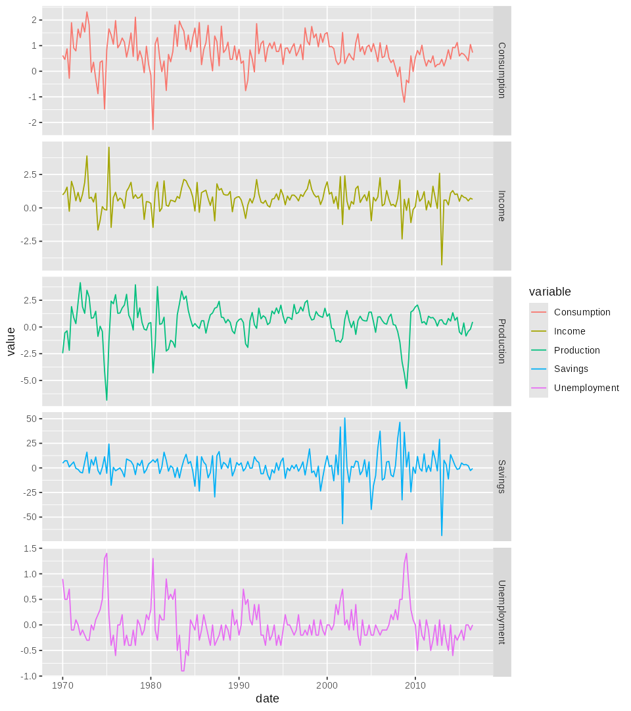
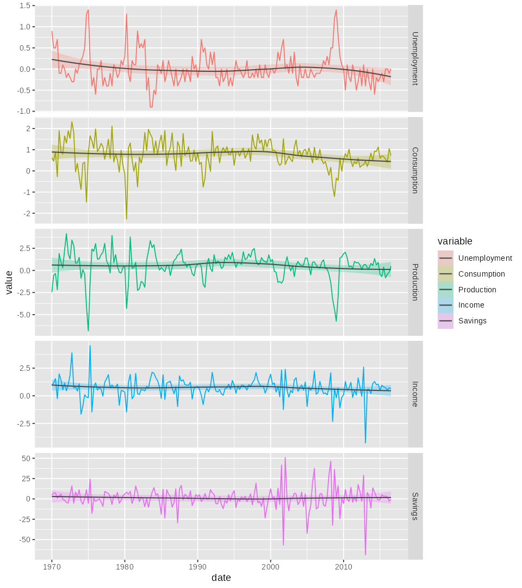
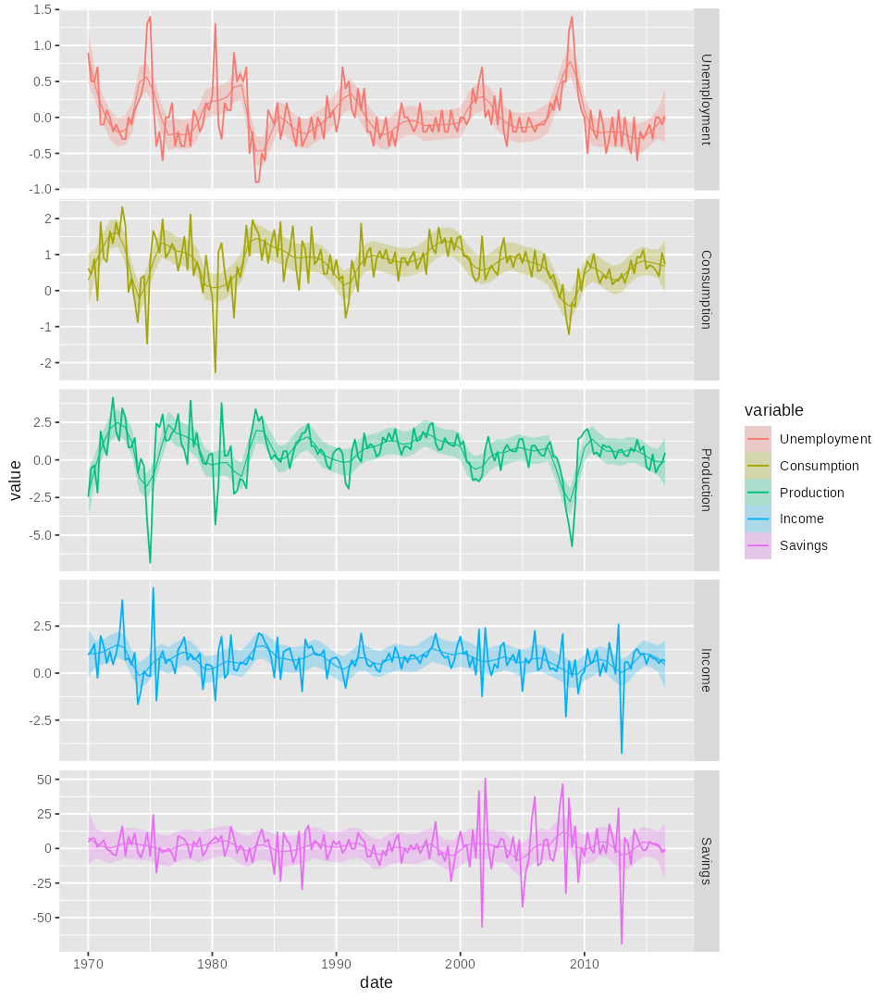
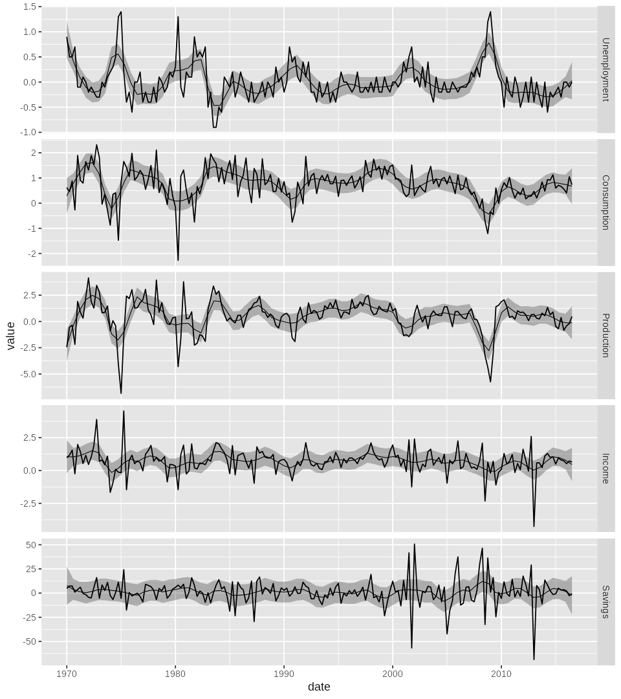
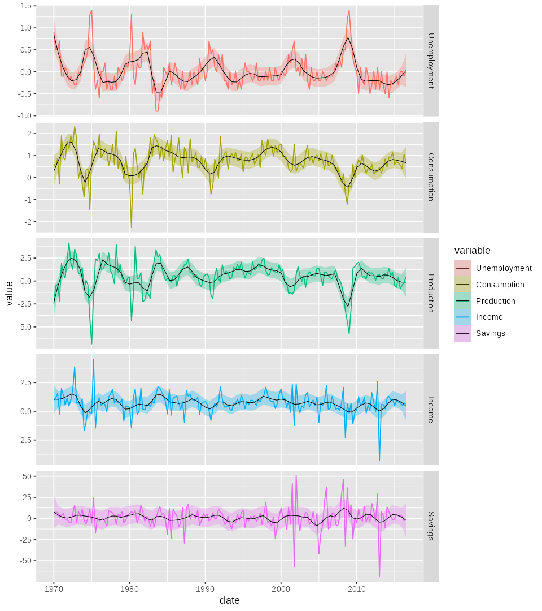

## The prompt

> I want to use the dataset `uschange_mts` (from `DataSetsVerse` /
> `timeSeriesDataSets`) to generate an R script using **ggplot2** to create a
> plot similar to the seaborn `lineplot` shown here. Since `uschange_mts` has
> 5 variables, just give each variable a different color and line style.

**The reference:**

{width=55%}

::: {.notes}
The starting point was a Python seaborn screenshot. The goal: reproduce the
look in ggplot2 on a different dataset.
:::

---

## What seaborn's `lineplot` actually does

`sns.lineplot(x="timepoint", y="signal", data=fmri)` does **three** things
behind the scenes:

1. **Group** rows by the `x` value (and any `hue` / `style`).
2. **Aggregate**: take the **mean** of `y` per group → the line/points.
3. **Estimate uncertainty**: bootstrap the values per group → 95 % CI ribbon.

So the ribbon needs **replicates per x value**. `fmri` has ~14 subjects per
timepoint. `uschange_mts` has **one** observation per quarter — no replicates.

::: {.fragment}
**Workaround for the first attempt:** treat the 4 quarters per year as
replicates, aggregate to year-level mean + 95% CI.
:::

---

## Step 1 — first attempt (year-aggregated, single panel)

::: {.columns}
::: {.column width="55%"}
```r
ggplot(df, aes(x = year, y = value,
               color = variable,
               linetype = variable,
               shape = variable)) +
  stat_summary(fun.data = mean_cl_normal,
               geom = "ribbon",
               aes(fill = variable),
               color = NA, alpha = 0.2) +
  stat_summary(fun = mean, geom = "line") +
  stat_summary(fun = mean, geom = "point",
               size = 2)
```
:::
::: {.column width="45%"}
- All 5 variables overlaid in one panel.
- color + linetype + shape per variable.
- ribbon = year-level 95 % CI from the 4 quarters in each year.
- It works but ranges of variables differ → some series are crammed.
:::
:::

---

## Step 2 — each variable gets its own y-axis

Add `facet_wrap(~ variable, scales = "free_y", ncol = 1)`.

Same year-aggregation, but now each series can use its own range. Easier to
read, but we're still throwing away ¾ of the data by aggregating quarters.

---

## Course correction

> "Drop the CIs for the new plot and plot every quarter."

So: no aggregation. Plot every quarterly observation, one panel per variable.

{width=70%}

---

## Step 3 — add loess smoothers with uncertainty

> "Provide loess lines w/ uncertainty fit to each time series."

First attempt used the ggplot2 default `span = 0.75`:

{width=70%}

The smoother averages out everything interesting.

---

## Step 4 — tighten the span, but mind the colors

> "A little less smoothing, make the loess lines thinner and the same color
> as the other lines."

`span = 0.1`, thinner line, no color override → loess picks up the variable
color and **disappears against the data line**:

{width=70%}

---

## Step 5 — black loess, but now everything is black

> "Go back to black lines."

Misread: the loess **and** the data line went black.

{width=70%}

> "No, just the loess lines black."

---

## Step 6 — final plot

> "Also make the uncertainty areas colored."

Data lines colored by variable, loess line black, ribbon colored per
variable. The black smoother sits cleanly on top of the colored series.

{width=70%}

---

## Final code

```r
library(DataSetsVerse); library(timeSeriesDataSets); library(tidyverse)

df <- as.data.frame(uschange_mts) |>
  mutate(
    date = as.Date(paste0(
      rep(1970:2016, each = 4)[seq_len(nrow(uschange_mts))], "-",
      c("01","04","07","10")[((seq_len(nrow(uschange_mts)) - 1) %% 4) + 1],
      "-01"))) |>
  pivot_longer(c(Consumption, Income, Production, Savings, Unemployment),
               names_to = "variable", values_to = "value") |>
  mutate(variable = factor(variable,
    levels = c("Unemployment","Consumption","Production","Income","Savings")))

ggplot(df, aes(x = date, y = value)) +
  geom_line(aes(color = variable)) +
  geom_smooth(aes(fill = variable), method = "loess", se = TRUE,
              span = 0.1, color = "black",
              alpha = 0.3, linewidth = 0.3) +
  facet_wrap(~ variable, scales = "free_y", ncol = 1,
             strip.position = "right") +
  labs(x = "date", y = "value", color = "variable")
```

---

## What the iteration loop looked like

| # | User feedback                                  | What changed in the code              |
|---|------------------------------------------------|---------------------------------------|
| 1 | "give each variable a different color & style" | initial year-aggregated overlay       |
| 2 | "each variable its own Y scale"                | `facet_wrap(scales = "free_y")`       |
| 3 | "drop CIs, plot every quarter"                 | remove `stat_summary`, use raw `date` |
| 4 | "everything solid"                             | drop `linetype` mapping               |
| 5 | "drop the dots, just lines"                    | remove `geom_point`                   |
| 6 | "reorder + loess w/ uncertainty"               | factor levels, `geom_smooth(loess)`   |
| 7 | "too much smoothing"                           | `span = 0.15` then `0.1`              |
| 8 | "thinner, same color"                          | `linewidth = 0.3`, drop color override |
| 9 | "go back to black"                             | misread → everything black            |
| 10 | "no, just the loess lines"                    | data lines re-colored                 |
| 11 | "color the uncertainty areas too"              | `fill = variable`                     |

---

## Take-aways

- **Start with what seaborn does, not what it shows.** Knowing it aggregates
  replicates told us why the first attempt needed a fake aggregation.
- **Iterate on the figure, not the spec.** Each step took one short
  instruction and one re-render. No upfront design doc.
- **Tiny ambiguities cost a round-trip.** "Go back to black" was
  under-specified — clarified in the next message.
- **Keep snapshots.** The PNGs above were saved at each stage so the
  iteration is reviewable after the fact.
- The full conversation transcript is available in
  `cclog-...html` (cclogviewer output).
