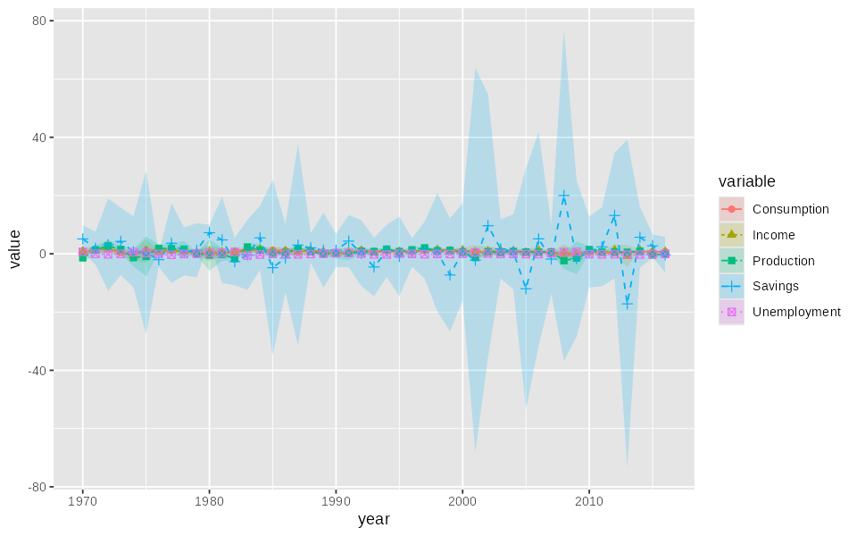
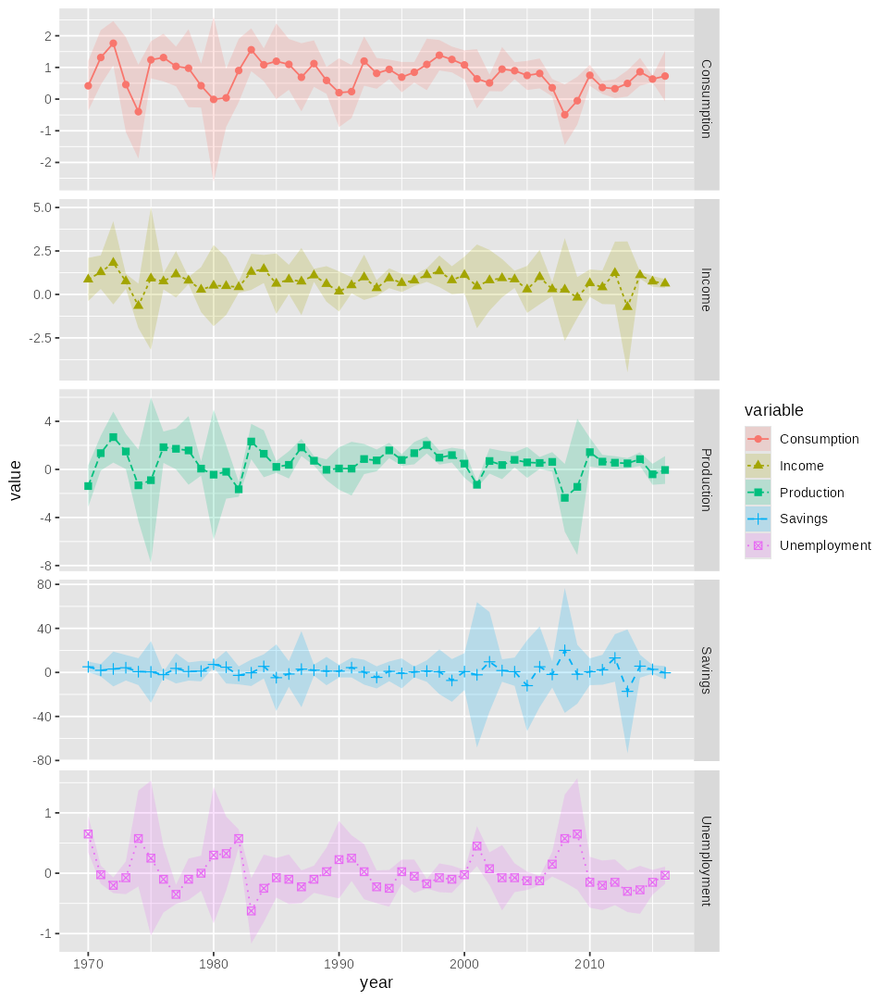
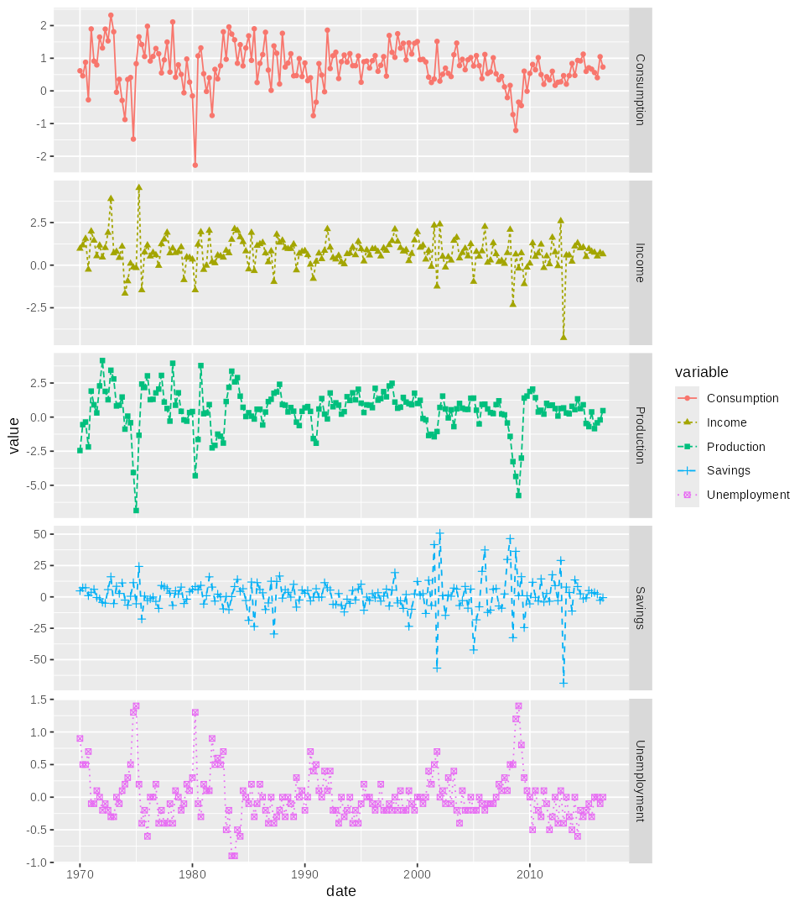

## The dataset

::: {style="font-size: 0.6em;"} 
Dataset from Hyndman & Athanasopoulos' Forecasting: Principles and Practice (fpp2/fpp3 package), which is derived from FRED.
In that dataset all five columns are quarterly percentage changes (quarter-over-quarter % change)
```{r}
library(timeSeriesDataSets) # Provides uschange_mts
DT::datatable(uschange_mts, options = list(pageLength = 10))
```
:::

## The prompt (paraphrased)

::: {.columns}

::: {.column width="48%"}

::: {style="font-size: 0.6em;"} 

> I want to use the dataset `uschange_mts` (from `DataSetsVerse` /
> `timeSeriesDataSets`) to generate an R script using **ggplot2** to create a
> plot similar to the seaborn `lineplot` shown here (with `seaborn` code below). Since `uschange_mts` has
> 5 variables, just give each variable a different color and line style.

:::

```python
import seaborn as sns
sns.set_theme(style="darkgrid")

# Load an example dataset with long-form data
fmri = sns.load_dataset("fmri")

# Plot the responses for different events and regions
sns.lineplot(x="timepoint", y="signal",
             hue="region", style="event",
             data=fmri) 
```

:::


::: {.column width="52%"}
*Reference plot image:*

{width=55%}
:::

:::

## `fmri` (functional MRI) data for reference plot

::: {style="font-size: 0.6em;"} 
```{r}
DT::datatable(read.csv(here::here("r_graphics/fmri.csv")), 
              options = list(pageLength = 10))
```
:::


## What seaborn's `lineplot` actually does

::: {.columns}
::: {.column width="40%"}

```python
import seaborn as sns
sns.set_theme(style="darkgrid")

# Load an example dataset with long-form data
fmri = sns.load_dataset("fmri")

# Plot the responses for different events and regions
sns.lineplot(x="timepoint", y="signal",
             hue="region", style="event",
             data=fmri) 
```

{width=55%}

:::


::: {.column width="60%"}

::: {style="font-size: 0.7em;"}

`sns.lineplot()` does this behind the scenes:

1. **Group** rows by the `x` value (and any `hue` / `style`).
2. **Aggregate**: take the **mean** of `y` per group → the line/points.
3. **Estimate uncertainty**: bootstrap the values per group → 95 % CI ribbon.

So the `seaborn`ribbon needs **replicates per x value**. `fmri` has ~14 subjects per
timepoint, each with 2 values of `event` and 2 values of `region`.
But `uschange_mts` has **one** observation per quarter — no replicates.

:::

:::

:::


## Step 1 — first attempt (year-aggregated, single panel)

::: {.columns}
::: {.column width="48%"}
```r
ggplot(df, aes(x = year, y = value,
               color = variable,
               linetype = variable,
               shape = variable)) +
  stat_summary(fun.data = mean_cl_normal,
               geom = "ribbon",
               aes(fill = variable),
               color = NA, alpha = 0.2) +
  stat_summary(fun = mean, geom = "line") +
  stat_summary(fun = mean, geom = "point",
               size = 2)
```

::: {style="font-size: 0.7em;"}
Obvious problem: Variable ranges differ → most series crammed.

The coding agent also wrote
"The seaborn `lineplot` aggregates replicates per `x` value into mean + 95% CI ribbon. `uschange_mts` has one observation per quarter, so I'll aggregate the 4 quarters per year to get the same mean+CI structure, with each variable getting its own color and linetype."
:::

:::
::: {.column width="52%"}

:::
:::

---

## Step 2, new prompt: "give each variable it's own Y axis scale."

::: {.columns}
::: {.column width="48%"}
```r
ggplot(df, aes(x = year, y = value,
               color = variable,
               linetype = variable,
               shape = variable)) +
  stat_summary(fun.data = mean_cl_normal,
               geom = "ribbon",
               aes(fill = variable),
               color = NA, alpha = 0.2) +
  stat_summary(fun = mean, geom = "line") +
  stat_summary(fun = mean, geom = "point",
               size = 2) +
  facet_wrap(~ variable, scales = "free_y",
             ncol = 1, strip.position = "right")
```

::: {style="font-size: 0.7em;"}
- One panel per variable, own y range.
- Linetype + shape still mapped per variable.
- Points = annual means, ribbon = 95 % CI.
- But what did the agent mean by
"The seaborn `lineplot` aggregates replicates per `x` value into mean + 95% CI ribbon. `uschange_mts` has one observation per quarter, so I'll aggregate the 4 quarters per year to get the same mean+CI structure, with each variable getting its own color and linetype."
:::

:::
::: {.column width="52%"}

:::
:::

---

## Step 2.1 new prompt: what do you mean by: "The seaborn lineplot aggregates replicates per x value into mean + 95% CI ribbon."? how does that work?

Response:

::: {style="font-size: 0.65em; max-height: 500px; overflow-y: auto; border: 1px solid #ccc; padding: 0.5em;"}
When you call `sns.lineplot(x="timepoint", y="signal", data=fmri)`, seaborn looks at the data and notices that for each `timepoint` value there are **many rows** (multiple subjects × trials all measured at, say, timepoint=5). Rather than draw all those points, it:

1. **Groups** the rows by the x value (and by any `hue`/`style` grouping).
2. **Aggregates** within each group: computes the **mean** of `y` (that's the line/point).
3. **Estimates uncertainty** around that mean: by default a **95% confidence interval**, computed by bootstrapping the values within the group (resample with replacement 1000× by default, take the 2.5th/97.5th percentiles of the bootstrap means). That's the shaded ribbon.

In the fmri dataset, there are ~14 subjects, each measured at 19 timepoints in 2 regions × 2 events, so a single point like `(timepoint=5, region=parietal, event=stim)` has ~14 signal values. The dot is their mean, the ribbon is the bootstrap 95% CI of that mean.

**Why this matters for `uschange_mts`:** that dataset has exactly one observation per quarter, so per-x there are no replicates to aggregate, no mean to take, no CI to compute. That's why I grouped 4 quarters into a year, to manufacture 4 "replicates" per x value so the same mean+CI machinery has something to chew on. With `stat_summary(fun.data = mean_cl_normal, …)` in ggplot2 I used the normal-approximation CI rather than a bootstrap, but the idea is the same.
:::

## BIG POINT -- I conflated 

::: {style="font-size: 1.2em;"}
* confidence interval ribbons showing smothing over replicates at each time point versus (`fmri`)
* confidence interval ribbons showing smoothing over time (`uschange`)
:::

## Step 2.2 new prompt: Ok, drop the CI's for the new plot and plot every quarter

::: {.columns}
::: {.column width="48%"}
```r
ggplot(df, aes(x = date, y = value,
               color = variable,
               linetype = variable,
               shape = variable)) +
  geom_line() +
  geom_point(size = 1.5) +
  facet_wrap(~ variable,
             scales = "free_y",
             ncol = 1,
             strip.position = "right")
```

- `x = date` → every quarterly observation, no more aggregation.
- No `stat_summary`, so no ribbon.
- Linetype + shape mappings kept (for now).
- Each quarter gets its own point + line segment.
:::
::: {.column width="52%"}

:::
:::

---

## Step 2.3, visually too crowded

::: {.columns}
::: {.column width="48%"}

::: {style="font-size: 0.7em;"}
Two new prompts:

> "make everything a solid line"

> "drop the dots on the points, just show the lines"

:::
```r
ggplot(df, aes(x = date, y = value,
               color = variable)) +
  geom_line() +
  facet_wrap(~ variable,
             scales = "free_y",
             ncol = 1,
             strip.position = "right")
```
::: {style="font-size: 0.7em;"}
- No more `stat_summary` aggregation.
- `x = date` → every quarterly observation.
- `linetype` and `shape` mappings dropped.
- `geom_point` removed.
- One solid colored line per panel.
:::

:::
::: {.column width="52%"}

:::
:::

---

## Step 3 Unemployment looks like inverse of Consumption and Production, which are similar, and need to smooth 

::: {.columns}
::: {.column width="48%"}

> change the order of the plot to Unemployment, Consumption, Production, Income, Savings, and provide loess lines w uncertainty fit to each timesearies


First attempt used the ggplot2 default `span = 0.75`


The smoother averages out everything interesting.
:::

::: {.column width="52%"}
{width=70%}

:::
:::

---

## Step 4 — tighten the span, but mind the colors

::: {.columns}
::: {.column width="48%"}
> "A little less smoothing, make the loess lines thinner and the same color

> as the other lines."

`span = 0.1`, thinner line, no color override → LOESS picks up the variable
color and **disappears against the data line**:
:::

::: {.column width="52%"}
{width=70%}
:::
:::

---

## Step 5 — black LOESS lines, but now everything is black

::: {.columns}
::: {.column width="48%"}
> "Go back to black lines."

Misread: the LOESS **and** the data line went black.
:::

::: {.column width="52%"}
{width=70%}
:::

:::

---

## Step 6 — final plot

::: {.columns}
::: {.column width="48%"}
> "No, just the loess lines black."

> "Also make the uncertainty areas colored."

Data lines colored by variable, LOESS line black, ribbon colored per
variable. The black smoother sits cleanly on top of the colored series.
:::

::: {.column width="52%"}
{width=70%}
:::

:::

---

## Final code

```r
library(DataSetsVerse); library(timeSeriesDataSets); library(tidyverse)

df <- as.data.frame(uschange_mts) |>
  mutate(
    date = as.Date(paste0(
      rep(1970:2016, each = 4)[seq_len(nrow(uschange_mts))], "-",
      c("01","04","07","10")[((seq_len(nrow(uschange_mts)) - 1) %% 4) + 1],
      "-01"))) |>
  pivot_longer(c(Consumption, Income, Production, Savings, Unemployment),
               names_to = "variable", values_to = "value") |>
  mutate(variable = factor(variable,
    levels = c("Unemployment","Consumption","Production","Income","Savings")))

ggplot(df, aes(x = date, y = value)) +
  geom_line(aes(color = variable)) +
  geom_smooth(aes(fill = variable), method = "loess", se = TRUE,
              span = 0.1, color = "black",
              alpha = 0.3, linewidth = 0.3) +
  facet_wrap(~ variable, scales = "free_y", ncol = 1,
             strip.position = "right") +
  labs(x = "date", y = "value", color = "variable")
```

---

## What the iteration loop looked like

| # | User feedback                                  | What changed in the code              |
|---|------------------------------------------------|---------------------------------------|
| 1 | "give each variable a different color & style" | initial year-aggregated overlay       |
| 2 | "each variable its own Y scale"                | `facet_wrap(scales = "free_y")`       |
| 3 | "drop CIs, plot every quarter"                 | remove `stat_summary`, use raw `date` |
| 4 | "everything solid"                             | drop `linetype` mapping               |
| 5 | "drop the dots, just lines"                    | remove `geom_point`                   |
| 6 | "reorder + loess w/ uncertainty"               | factor levels, `geom_smooth(loess)`   |
| 7 | "too much smoothing"                           | `span = 0.15` then `0.1`              |
| 8 | "thinner, same color"                          | `linewidth = 0.3`, drop color override |
| 9 | "go back to black"                             | misread → everything black            |
| 10 | "no, just the loess lines"                    | data lines re-colored                 |
| 11 | "color the uncertainty areas too"              | `fill = variable`                     |

---

## Lessons learned

This took 22.25 minutes (including `git commit` at the end)

Getting to LOESS fitting with confidence interval ribbons took 9 minutes

Concepts are critical (confidence interval ribbons based on per-time-point replicates versus confidence interval ribbons from LOESS smoothing)

Understand your data (`uschange` has no replicates per time point and has very different ranges for each column/variable)

** TO DO, get conceptual description of LOESS smoothing **

We need a dialog w/ coding agent (clarifying the no replicates per time points).

I think we need to speak R/Python to engage in that dialog, and sometimes must faster to make adjustments yourself rather than ask the coding agent to do it [can partly fill that gap with skills] but this is not really shown in the `uschange` plotting example.

This is different from analogy with R/Python > C/C++ > assembly code;  we almost never have to check what assembly code was generated.
However, sometimes we need to check the algorithm details. An example is the regular expression denial of service attack

You have to understand the data to plot it (but sometimes you need to plot it to understand it) so it can be an iterative process, especially when it is brand new data.

A lot of programming is adapting exisitng patterns to new data. This is not new -- you dont have to invent Fisher's test or regular expressions each time ... some collective memory was abstracted in functions and libraries.

Can't always formally spec the connection between new data and existing patterns; LLM's can make the connection because have access to unformalized collective memory in the form of statistical properties of natural languages and programming languages


The full conversation transcript is available in
  `cclog-...html` (cclogviewer output).
